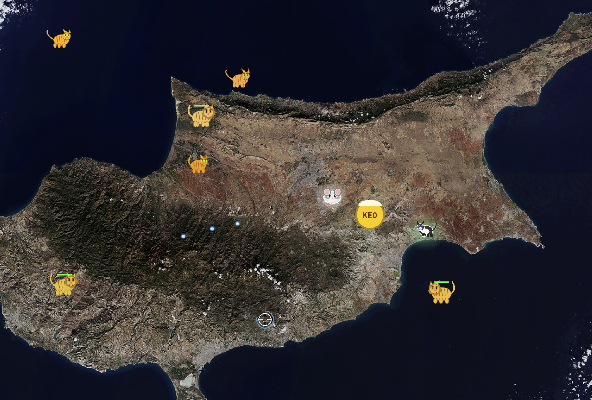

# Cyprus Mouse Defense

Browser-based 2D shooter game. A mouse defends itself from evil cats, lions and tigers on the island of Cyprus by shooting water at them. Works on desktop and mobile.

## How to Play

Open `index.html` in a browser or play at [ppleskov.github.io/cyprus-mouse-defense](https://ppleskov.github.io/cyprus-mouse-defense/)

### Controls

| Action | Desktop | Mobile |
|--------|---------|--------|
| Shoot water | Click | Tap |
| Throw souvlaki bait | Right-click | BAIT button → tap location |
| Start / Restart | Tap or Enter | Tap |

### Enemies

- **Cats** (orange) — 1 hit to scare, -1 life if they reach you
- **Lions** (golden, with mane) — 3 hits to scare, -2 lives. Appear after 30s
- **Tigers** (orange with black stripes, large) — 5 hits to scare, -3 lives. Appear after 90s
- **Zora** (black & white cat) is friendly — if she reaches the mouse, you gain a life. Don't accidentally scare her!

### Pickups

Shoot them with water to collect:

- **KEO** (yellow) — mouse gets drunk, aim wobbles for 8 seconds
- **Souvlaki** — adds to inventory. Throw as bait — enemies go to it instead of you
- **Easter Egg** (red) — explodes on hit, scares all enemies on screen

### Other

- **Water is limited** — watch the supply bar, it regenerates over time
- Chain hits for **combo multipliers**

## Features

- Satellite map of Cyprus (ESA) as the game background
- Progressive difficulty — cats spawn faster, lions and tigers join over time
- Multi-hit enemies with HP bars and knockback
- Cyprus-themed pickups: KEO beer, souvlaki bait, Easter eggs
- Combo scoring system with milestones
- Particle effects, screen shake, floating text
- Mobile touch support with on-screen controls
- High score saved in localStorage

## Tech

Single-file game (`index.html`) — HTML5 Canvas, vanilla JS, no dependencies.
